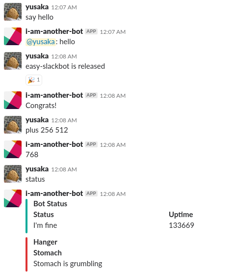

# easy-slackbot
 [](https://jitpack.io/#yusaka39/easy-slackbot)
[](https://circleci.com/gh/yusaka39/easy-slackbot)


An easy way to build your own slack bot.

# Getting started
Buildable sample is [here](./sample)

## Configure project
Add `easy-slackbot` and `slf4j-api` as a dependency. A gradle example is below.

```gradle
repositories {
    ...
    maven { url 'https://jitpack.io' }
}

dependencies {
    compile 'com.github.yusaka39:easy-slackbot:0.0.1'
    compile 'org.slf4j:slf4j-api:1.7.25' // Required
    compile 'org.slf4j:slf4j-simple:1.7.25' // Optional
}
```

If you want to see logs, you need add a slf4j binder as a dependency. In example, `slf4j-simple` is added as a binder.

You can see full `build.gradle` [here](./sample/build.gradle)

## Code a bot
It is easy to make a simple bot.

```kotlin
package io.github.yusaka39.easySlackbot.sample

import io.github.yusaka39.easySlackbot.annotations.GroupParam
import io.github.yusaka39.easySlackbot.annotations.HandlerFunction
import io.github.yusaka39.easySlackbot.bot.Bot
import io.github.yusaka39.easySlackbot.router.HandlerPack
import io.github.yusaka39.easySlackbot.router.actions.PostAction

fun main(args: Array<String>) {
    Bot(args[0], "io.github.yusaka39.easySlackbot.sample").run()
}

// Classes contains handler functions must extend HandlerPack and have a primary constructor without arguments
class Handlers : HandlerPack() {
    @HandlerFunction("""^say\s+(.*)""")
    // Handler functions must return an instance of Action
    fun say(@GroupParam(1) words: String) =
        PostAction(this.receivedMessage.channel, "${this.receivedMessage.user.replyString}: $words")
    
    // You can give RegexOption
    @HandlerFunction("is released", regexOption = [RegexOption.IGNORE_CASE])
    fun congrats() =
        // Actions can be composed
        PutReactionAction(this.receivedMessage, "tada") compose PostAction(this.receivedMessage.channel, "Congrats!")
}
```



You can see more sample [here](./sample/src/main/kotlin/io/github/yusaka39/easySlackbot/sample/Main.kt)
